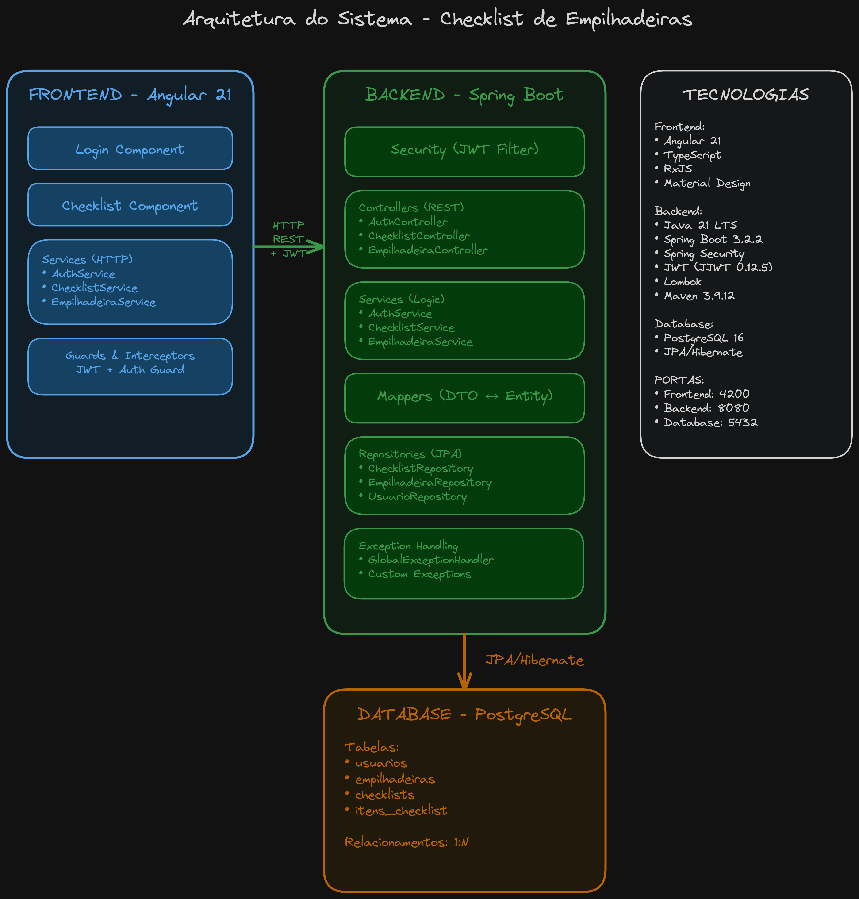
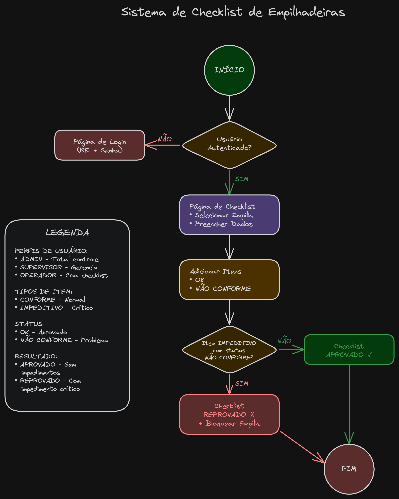

# Sistema de Checklist de Empilhadeiras 
API REST desenvolvida em Spring Boot para gerenciamento de checklists de empilhadeiras.

## 🌱 Impacto do Projeto

Esse projeto de sistema de checklist digital de empilhadeira impactou em:

* **Alinhamento com os valores da empresa**, promovendo inovação, responsabilidade e melhoria contínua dos processos
* **Redução significativa do uso de papel**, reforçando o compromisso com a preservação do meio ambiente
* **Diminuição de desperdícios** causados por reimpressões, rasuras e falhas no preenchimento manual
* **Conscientização dos operadores** quanto ao uso responsável de recursos
* **Adoção de práticas sustentáveis**, contribuindo para a redução de resíduos e do impacto ambiental
* **Modernização do processo de inspeção**, substituindo controles manuais por uma solução digital e inteligente
* **Fortalecimento da imagem da empresa** como organização comprometida com sustentabilidade e tecnologia

## 📊 Diagramas do Sistema

### Arquitetura Técnica


*Diagrama mostrando a arquitetura completa do sistema: Frontend (Angular), Backend (Spring Boot) e Database (PostgreSQL)*

### Fluxograma do Sistema


*Fluxograma detalhado do processo de uso do sistema, desde o login até a conclusão do checklist*

## 🚀 Tecnologias Utilizadas

- **Java 21** (OpenJDK 21.0.8 LTS)
- **Spring Boot 3.2.2**
  - Spring Web
  - Spring Data JPA
  - Spring Security
  - Spring Validation
- **PostgreSQL 16**
- **Maven 3.9.12**
- **JWT (JSON Web Token)** para autenticação
- **Lombok** para redução de boilerplate
- **BCrypt** para encriptação de senhas

## 📋 Pré-requisitos

- Java 21 ou superior
- Maven 3.9.12 ou superior
- PostgreSQL 16 ou superior
- Variáveis de ambiente (opcionais):
  - `DB_USERNAME` (padrão: postgres)
  - `DB_PASSWORD` (padrão: admin)
  - `JWT_SECRET` (padrão fornecido)

## 🔧 Instalação e Configuração

### 1. Clonar o repositório

```bash
cd checklist-backend
```

### 2. Configurar o Banco de Dados

Criar o banco de dados no PostgreSQL:

```sql
CREATE DATABASE checklist_db;
```

### 3. Configurar variáveis de ambiente (opcional)

```bash
export DB_USERNAME=postgres
export DB_PASSWORD=*****
export JWT_SECRET=sua-chave-secreta-aqui
```

Ou edite o arquivo `src/main/resources/application.properties`.

### 4. Compilar o projeto

```bash
mvn clean install
```

### 5. Executar a aplicação

```bash
mvn spring-boot:run
```

Ou execute o JAR gerado:

```bash
java -jar target/checklist-backend-1.0.0.jar
```

A API estará disponível em: `http://localhost:8080/api`

## 📦 Estrutura do Projeto

```
src/main/java/com/deicmar/checklist/
├── ChecklistApplication.java          # Classe principal
├── controller/                        # Controllers REST
│   ├── AuthController.java
│   ├── ChecklistController.java
│   ├── EmpilhadeiraController.java
│   └── UsuarioController.java
├── service/                          # Lógica de negócio
│   ├── AuthService.java
│   ├── ChecklistService.java
│   ├── EmpilhadeiraService.java
│   └── UsuarioService.java
├── repository/                       # Acesso a dados (JPA)
│   ├── ChecklistRepository.java
│   ├── EmpilhadeiraRepository.java
│   └── UsuarioRepository.java
├── model/
│   ├── entity/                      # Entidades JPA
│   │   ├── Checklist.java
│   │   ├── Empilhadeira.java
│   │   ├── ItemChecklist.java
│   │   └── Usuario.java
│   └── enums/                       # Enumerações
│       ├── Perfil.java
│       ├── ResultadoChecklist.java
│       ├── StatusItem.java
│       ├── TipoItem.java
│       └── Turno.java
├── dto/                             # Data Transfer Objects
│   ├── auth/
│   ├── checklist/
│   ├── empilhadeira/
│   ├── error/
│   └── usuario/
├── mapper/                          # Conversores Entity <-> DTO
│   ├── ChecklistMapper.java
│   ├── EmpilhadeiraMapper.java
│   └── UsuarioMapper.java
├── security/                        # Configuração de segurança
│   ├── JwtAuthenticationFilter.java
│   ├── JwtUtil.java
│   └── SecurityConfig.java
└── exception/                       # Exceções e handlers
    ├── BusinessException.java
    ├── GlobalExceptionHandler.java
    └── ResourceNotFoundException.java
```

## 🔐 Autenticação

A API utiliza JWT (JSON Web Token) para autenticação. Após o login, inclua o token no header de todas as requisições:

```
Authorization: Bearer {seu-token-jwt}
```

### Perfis de Usuário

- **ADMIN**: Acesso total ao sistema
- **SUPERVISOR**: Gerenciamento de empilhadeiras e visualização de relatórios
- **OPERADOR**: Criação de checklists e visualização dos próprios checklists

## 📚 Endpoints da API

### Autenticação

#### POST `/api/auth/login`
Realiza login no sistema.

**Request:**
```json
{
  "re": "OPR001",
  "senha": "senha123"
}
```

**Response:**
```json
{
  "token": "eyJhbGciOiJIUzI1NiIsInR5cCI6IkpXVCJ9...",
  "tipo": "Bearer",
  "usuarioId": 1,
  "re": "OPR001",
  "nomeCompleto": "João Silva",
  "perfil": "OPERADOR"
}
```

### Usuários

| Método | Endpoint | Descrição | Perfil Requerido |
|--------|----------|-----------|------------------|
| POST | `/api/usuarios` | Criar usuário | ADMIN |
| GET | `/api/usuarios` | Listar todos | ADMIN, SUPERVISOR |
| GET | `/api/usuarios/ativos` | Listar ativos | ADMIN, SUPERVISOR |
| GET | `/api/usuarios/{id}` | Buscar por ID | ADMIN, SUPERVISOR |
| GET | `/api/usuarios/re/{re}` | Buscar por RE | ADMIN, SUPERVISOR |
| GET | `/api/usuarios/perfil/{perfil}` | Listar por perfil | ADMIN, SUPERVISOR |
| DELETE | `/api/usuarios/{id}` | Inativar usuário | ADMIN |
| PATCH | `/api/usuarios/{id}/senha` | Atualizar senha | ADMIN |

### Empilhadeiras

| Método | Endpoint | Descrição | Perfil Requerido |
|--------|----------|-----------|------------------|
| POST | `/api/empilhadeiras` | Criar empilhadeira | ADMIN, SUPERVISOR |
| GET | `/api/empilhadeiras` | Listar todas | Todos |
| GET | `/api/empilhadeiras/ativas` | Listar ativas | Todos |
| GET | `/api/empilhadeiras/disponiveis` | Listar disponíveis | Todos |
| GET | `/api/empilhadeiras/bloqueadas` | Listar bloqueadas | ADMIN, SUPERVISOR |
| GET | `/api/empilhadeiras/{id}` | Buscar por ID | Todos |
| PATCH | `/api/empilhadeiras/{id}/bloquear` | Bloquear empilhadeira | ADMIN, SUPERVISOR |
| PATCH | `/api/empilhadeiras/{id}/desbloquear` | Desbloquear empilhadeira | ADMIN, SUPERVISOR |
| DELETE | `/api/empilhadeiras/{id}` | Inativar empilhadeira | ADMIN |

### Checklists

| Método | Endpoint | Descrição | Perfil Requerido |
|--------|----------|-----------|------------------|
| POST | `/api/checklists` | Criar checklist | Todos |
| GET | `/api/checklists` | Listar todos | ADMIN, SUPERVISOR |
| GET | `/api/checklists/{id}` | Buscar por ID | Todos |
| GET | `/api/checklists/empilhadeira/{id}` | Listar por empilhadeira | ADMIN, SUPERVISOR |
| GET | `/api/checklists/operador/{id}` | Listar por operador | Todos |
| GET | `/api/checklists/data/{data}` | Listar por data | ADMIN, SUPERVISOR |
| GET | `/api/checklists/periodo` | Listar por período | ADMIN, SUPERVISOR |

## 📝 Exemplos de Requisições

### Criar um Checklist

**POST** `/api/checklists`

```json
{
  "data": "2025-02-01",
  "horaVistoria": "08:30:00",
  "turno": "A",
  "horimetroInicial": 15000,
  "horimetroFinal": 15100,
  "operadorId": 3,
  "empilhadeiraId": 1,
  "itens": [
    {
      "descricao": "Verificação de freios",
      "tipo": "IMPEDITIVO",
      "status": "OK",
      "observacao": "Freios em perfeito estado"
    },
    {
      "descricao": "Nível de óleo",
      "tipo": "CONFORME",
      "status": "OK"
    },
    {
      "descricao": "Estado dos pneus",
      "tipo": "IMPEDITIVO",
      "status": "NAO_CONFORME",
      "observacao": "Pneu traseiro direito desgastado"
    }
  ],
  "observacaoGeral": "Empilhadeira necessita troca de pneu"
}
```

### Bloquear Empilhadeira

**PATCH** `/api/empilhadeiras/1/bloquear`

```json
{
  "motivo": "Manutenção preventiva programada"
}
```

## 🔍 Regras de Negócio

### Checklist

1. **Cálculo de Resultado:**
   - **APROVADO**: Quando nenhum item impeditivo está não conforme
   - **REPROVADO**: Quando pelo menos um item impeditivo está não conforme

2. **Bloqueio Automático:**
   - Empilhadeiras são automaticamente bloqueadas quando um checklist é reprovado
   - Apenas ADMIN e SUPERVISOR podem desbloquear empilhadeiras

3. **Validações:**
   - Operador deve estar ativo
   - Empilhadeira deve estar ativa e não bloqueada
   - Horímetro final não pode ser menor que o inicial
   - Data não pode ser futura

### Empilhadeira

- Uma empilhadeira bloqueada não pode ser usada em novos checklists
- Apenas usuários ADMIN podem inativar empilhadeiras
- Empilhadeiras inativas não aparecem nas listagens de disponíveis

### Usuário

- RE deve ser único no sistema
- Senha deve ter no mínimo 6 caracteres
- Senhas são armazenadas com hash BCrypt
- Apenas ADMIN pode criar e gerenciar usuários

## 🛠️ Configurações Importantes

### CORS

O CORS está configurado para aceitar requisições de:
- `http://localhost:4200` (Angular)
- `http://localhost:8080`

Para adicionar mais origens, edite `SecurityConfig.java`.

### JWT

- **Expiração:** 24 horas (86400000 ms)
- **Secret:** Configurável via variável de ambiente `JWT_SECRET`
- **Algorithm:** HS256

### Database

- **Dialect:** PostgreSQL
- **DDL:** update (cria/atualiza tabelas automaticamente)
- **Show SQL:** true (ambiente de desenvolvimento)
- **Timezone:** America/Sao_Paulo

## 🧪 Dados de Teste

Execute o script `src/main/resources/init.sql` para popular o banco com dados de teste:

### Usuários de Teste (senha: senha123)
- **ADM001** - Administrador Sistema (ADMIN)
- **SUP001** - Supervisor Geral (SUPERVISOR)
- **OPR001** - João Silva (OPERADOR)
- **OPR002** - Maria Santos (OPERADOR)
- **OPR003** - Pedro Oliveira (OPERADOR)

### Empilhadeiras de Teste
- YALE GP030 - Elétrica - 3000kg
- TOYOTA 8FBE20 - Elétrica - 2000kg
- HYSTER H50FT - GLP - 5000kg
- CATERPILLAR GP25N - Diesel - 2500kg
- LINDE E16 - Elétrica - 1600kg (Bloqueada)
- STILL RX60-30 - Elétrica - 3000kg

## 📊 Logging

Os logs são configurados com os seguintes níveis:

- **Root:** INFO
- **com.deicmar:** DEBUG
- **Spring Security:** DEBUG
- **Hibernate SQL:** DEBUG

Logs incluem:
- Requisições HTTP
- Queries SQL
- Operações de negócio
- Erros e exceções

## 🚨 Tratamento de Erros

A API retorna erros no formato padrão:

```json
{
  "timestamp": "2025-02-01T10:30:00",
  "status": 404,
  "error": "Recurso não encontrado",
  "message": "Empilhadeira não encontrada com ID: 999",
  "details": null
}
```

### Códigos de Status HTTP

- **200 OK:** Requisição bem-sucedida
- **201 Created:** Recurso criado com sucesso
- **204 No Content:** Operação bem-sucedida sem conteúdo de retorno
- **400 Bad Request:** Dados inválidos ou erro de validação
- **401 Unauthorized:** Credenciais inválidas ou token expirado
- **403 Forbidden:** Sem permissão para acessar o recurso
- **404 Not Found:** Recurso não encontrado
- **500 Internal Server Error:** Erro interno do servidor

## 📈 Melhorias Futuras

- [ ] Implementar paginação nos endpoints de listagem
- [ ] Adicionar filtros avançados de busca
- [ ] Implementar cache com Redis
- [ ] Adicionar testes unitários e de integração
- [ ] Implementar documentação Swagger/OpenAPI
- [ ] Adicionar métricas com Actuator
- [ ] Implementar auditoria completa de operações
- [ ] Adicionar suporte a upload de imagens nos checklists
- [ ] Implementar notificações em tempo real
- [ ] Adicionar relatórios em PDF

